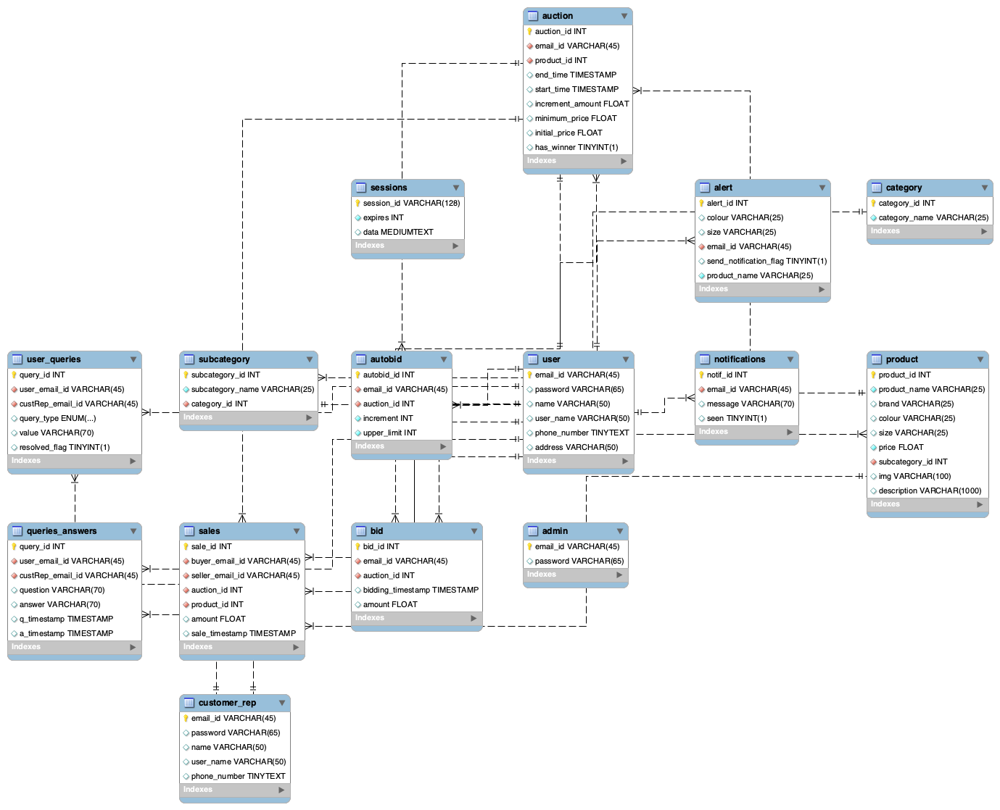

# Buy-Me App Setup Guide

## Installation
- Download or clone the repository using the following command: `git clone git@github.com:vamsi-bulusu/Buy-Me.git`
- Install NodeJS library from https://nodejs.org/en/download
- Install Dependencies using `npm install`

## Database Setup
- Run the schema migration by executing the schema.sql file located in the config folder.

## Environment Variables
- Set the following environment variables in a `.env` file:
  - `DB_HOST`: The database host
  - `DB_USER`: The database username
  - `DB_PASSWORD`: The database password
  - `DB_DATABASE`: The database name
  - `DB_PORT`: The database port
  - `USER_PORT`: The port for the NodeJS app
  - `SECRET_KEY`: The secret key
  - `ADMIN_SECRET_KEY`: The admin secret key
  - `CUSTOMER_SECRET_KEY`: The customer secret key

## Running the App
- To run the Admin app, execute `npm run admin`
- To run the Customer app, execute `npm run customer`
- To run the User app, execute `npm run develop`

## URLs
- Login URL: http://localhost:PORT/api/login
- Admin URL: http://localhost:PORT/api/admin/login
- Customer URL: http://localhost:PORT/api/customerRep/login

## ERD

## ROLES

- Darshee Machhar - Worked on SQL Queries and Database Design
- Pankti Nanvati - Worked on Frontend development
- Naga Vamsi Krishna - Worked on configuring routes and app infra

## Admin Credentials:

- email: admin@rutgers.edu
- password: test@123

